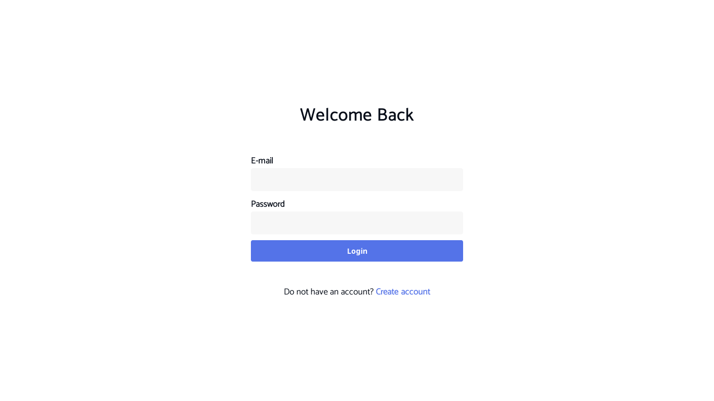
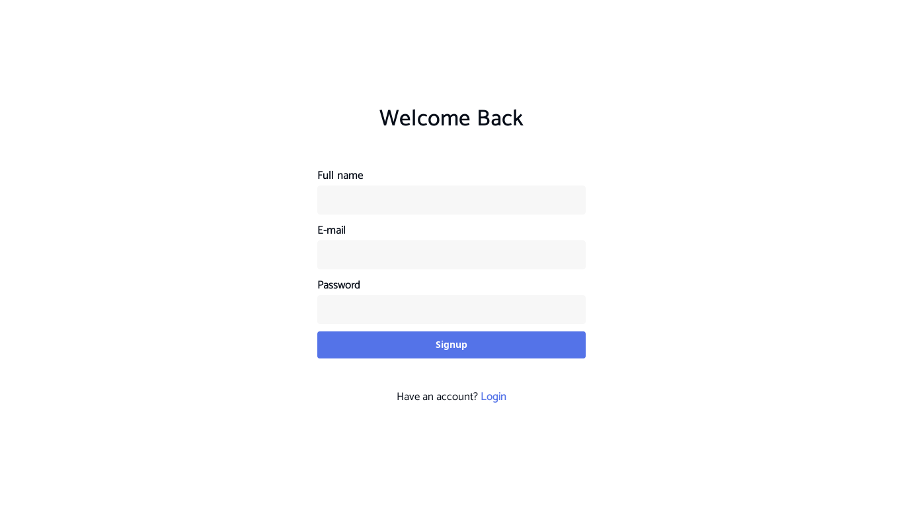
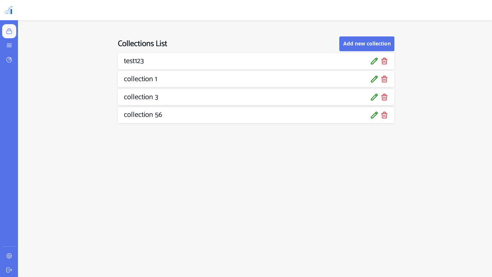
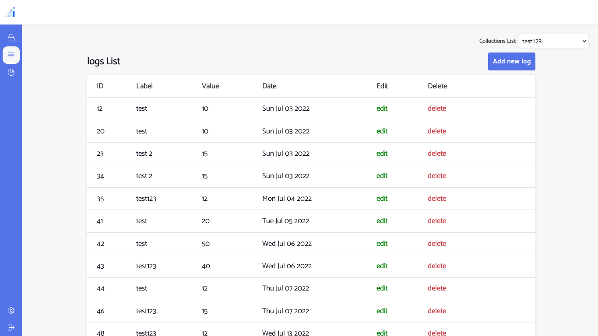
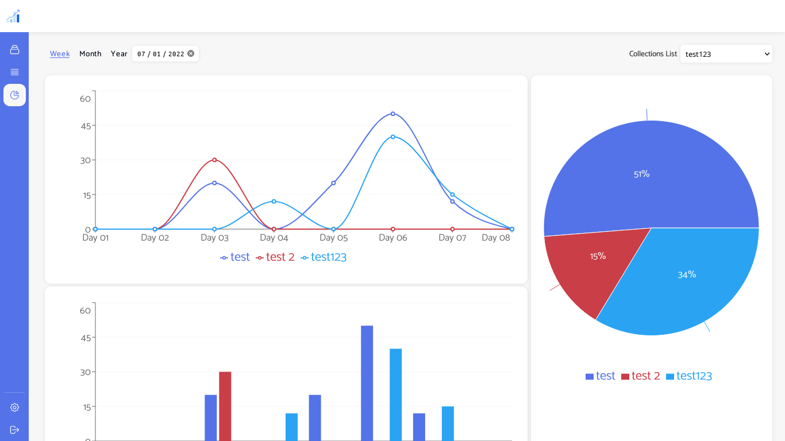
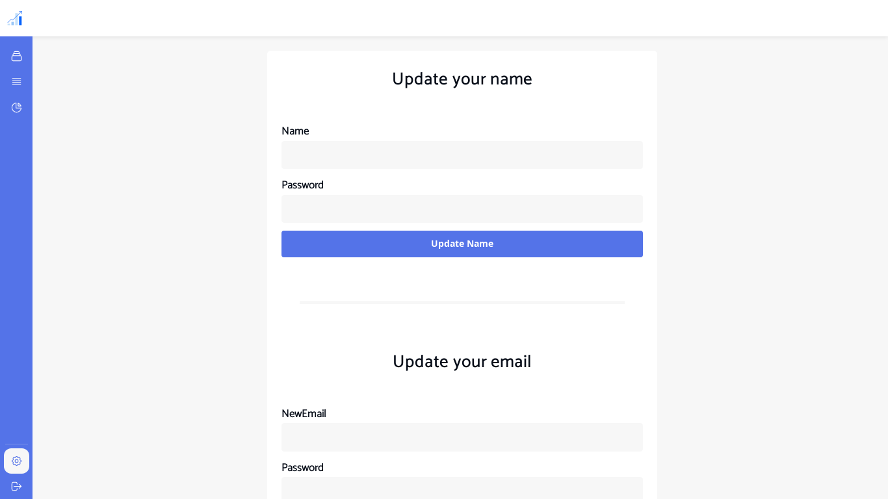

# Statistics REST API

This is an web interface for the Statistics REST API [https://gitlab.com/seif-projects/statictics/api](https://gitlab.com/seif-projects/statictics/api)

# Used Technologies

- Next.js
- Recharts

# Quick Start

```console
$ npm i
$ npm run dev
```

# Pages

## Login Page



## Signup Page



## Signup Page



## Logs Page



## Statistics Page



## Settings Page


